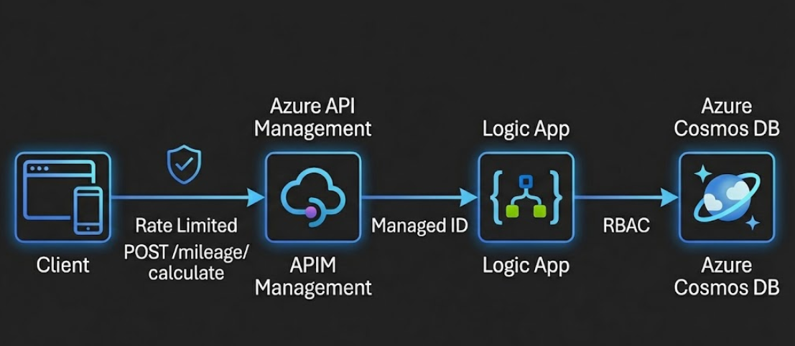

<!-- markdownlint-disable MD033 -->

# 🔄 iPaaS Patterns

[](https://github.com/firstcontributions/open-source-badges)

## Overview

This repository contains **Infrastructure as Code (IaC)** patterns for building enterprise integration solutions on Azure using the **Integration Platform as a Service (iPaaS)** approach.

The labs demonstrate how to combine **Azure API Management**, **Logic Apps**, and **Cosmos DB** to build secure, scalable, and observable integration workflows.

## 🏗️ Architecture

```
┌─────────────┐     ┌─────────────────────┐     ┌─────────────────┐     ┌─────────────────┐
│   Client    │────▶│   API Management    │────▶│    Logic App    │────▶│    Cosmos DB    │
│             │     │   • Rate Limiting   │     │   • Workflows   │     │   • NoSQL Data  │
│             │     │   • Auth & Security │     │   • Managed ID  │     │   • RBAC Auth   │
└─────────────┘     └─────────────────────┘     └─────────────────┘     └─────────────────┘
```

## 🧪 Labs

### [🧪 Mileage Tracking API](labs/mileage-tracking/mileage-tracking.ipynb)

Build an end-to-end integration solution with API Management fronting a Logic App workflow that stores data in Cosmos DB using Managed Identity authentication.

[](labs/mileage-tracking/mileage-tracking.ipynb)

**Features:**
- 🔐 Rate limiting (5 calls/60s)
- 🔑 Subscription key authentication
- 🤖 Managed Identity for Cosmos DB access
- 📊 End-to-end observability

[🦾 Bicep](labs/mileage-tracking/main.bicep) ➕ [⚙️ Policy](labs/mileage-tracking/apim-policy.xml) ➕ [🧾 Notebook](labs/mileage-tracking/mileage-tracking.ipynb)

---

## 🚀 Getting Started

### Prerequisites

- [Python 3.12 or later](https://www.python.org/) installed
- [VS Code](https://code.visualstudio.com/) installed with the [Jupyter notebook extension](https://marketplace.visualstudio.com/items?itemName=ms-toolsai.jupyter) enabled
- [Azure CLI](https://learn.microsoft.com/cli/azure/install-azure-cli) installed
- [An Azure Subscription](https://azure.microsoft.com/free/) with Contributor permissions
- [Sign in to Azure with Azure CLI](https://learn.microsoft.com/cli/azure/authenticate-azure-cli-interactively)

### Quick Start

```bash
# Clone the repository
git clone https://github.com/odaibert/ipaas-patterns.git
cd ipaas-patterns

# Open the lab notebook
code labs/mileage-tracking/mileage-tracking.ipynb
```

---

## 🏛️ Well-Architected Framework

This solution follows the [Azure Well-Architected Framework](https://learn.microsoft.com/azure/well-architected/) principles:

| Pillar | Implementation |
|--------|----------------|
| **Security** | Managed Identity, RBAC, API subscription keys |
| **Reliability** | APIM retry policies, Cosmos DB multi-region |
| **Performance** | Rate limiting, efficient NoSQL queries |
| **Cost Optimization** | BasicV2 APIM tier, Consumption Logic App |
| **Operational Excellence** | Infrastructure as Code, observability |

---

## 📁 Repository Structure

```
├── README.md                    # This file
├── labs/
│   └── mileage-tracking/        # Mileage tracking lab
│       ├── main.bicep           # Infrastructure template
│       ├── apim-policy.xml      # APIM policies
│       ├── mileage-tracking.ipynb # Lab notebook
│       ├── clean-up-resources.ipynb
│       └── README.md
├── shared/
│   └── utils.py                 # Shared utilities
└── images/                      # Documentation images
```

---

## 🥇 Resources

- [Azure API Management Documentation](https://learn.microsoft.com/azure/api-management/)
- [Azure Logic Apps Documentation](https://learn.microsoft.com/azure/logic-apps/)
- [Azure Cosmos DB Documentation](https://learn.microsoft.com/azure/cosmos-db/)
- [Bicep Documentation](https://learn.microsoft.com/azure/azure-resource-manager/bicep/)

---

## 🤝 Contributing

Contributions are welcome! Please feel free to submit a Pull Request.

## 📄 License

This project is licensed under the MIT License - see the [LICENSE](LICENSE) file for details.
