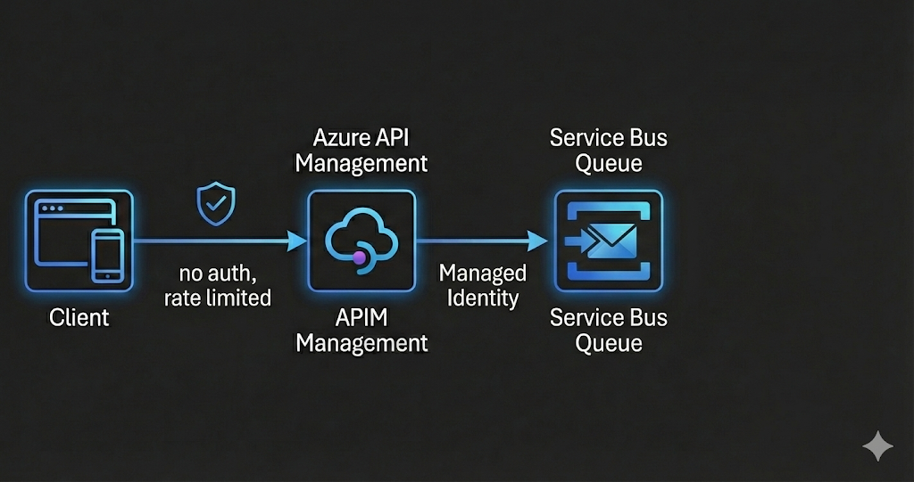

# APIM and Service Bus

## Contact Form Intake Lab (contact-form.ipynb)

Build a simple integration that accepts contact form submissions and enqueues them to a Service Bus queue.

### Architecture

### Features

- API Management gateway (BasicV2 - fastest deployment ~5 min)
- No authentication required (educational purposes)
- Rate limiting at the edge (10 calls/min per IP)
- APIM authenticates to Service Bus using **Managed Identity**
- Service Bus queue for asynchronous processing
- Fully automated deployment via Bicep

### Prerequisites

- Python 3.12 or later installed
- VS Code with Jupyter extension enabled
- Azure CLI installed
- An Azure Subscription with Contributor permissions
- Sign in to Azure with Azure CLI

### Get started

Open the notebook and follow the steps:

- `contact-form.ipynb`

### Clean up resources

Use the clean-up notebook to delete the resource group:

- `clean-up-resources.ipynb`

### Files

| File | Description |
|------|-------------|
| `main.bicep` | Infrastructure as Code template |
| `apim-policy.xml` | APIM policy for Service Bus enqueue (reference) |
| `contact-form.ipynb` | Lab notebook |
| `clean-up-resources.ipynb` | Cleanup notebook |
